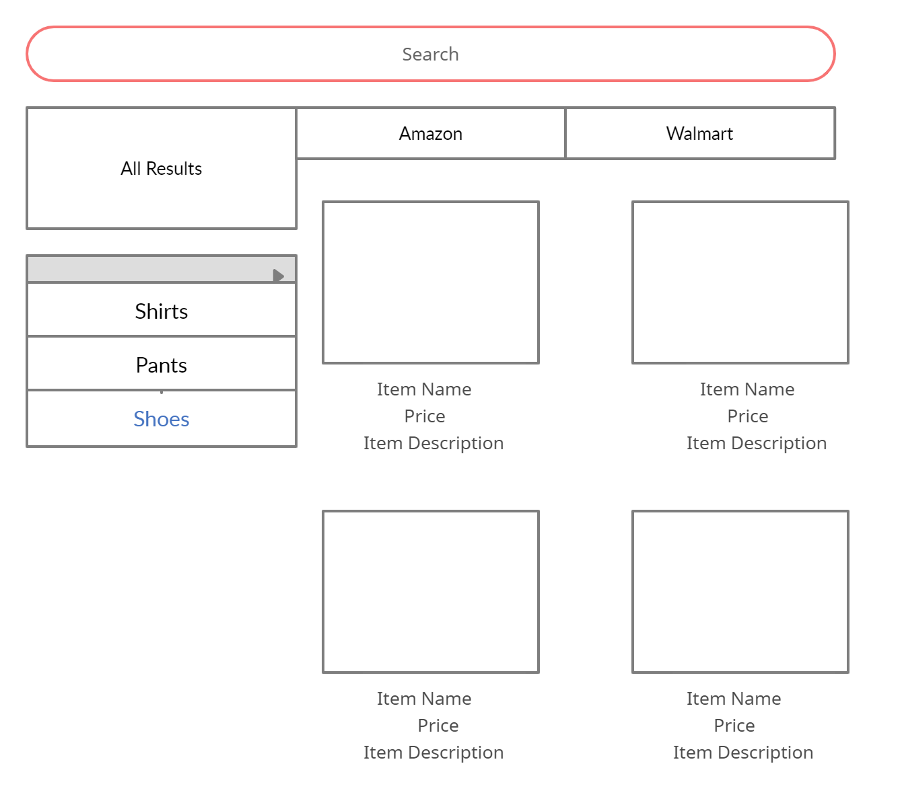
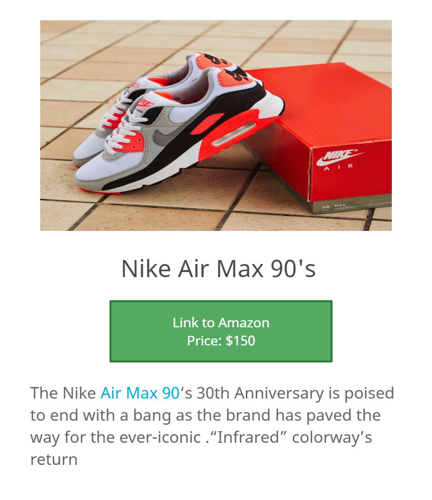

# **Cheap Sheep** by Monica Howze, Aaron Holloman & Dreon Wheatley-Owens

## Table of Contents
1. [Overview](#Overview)
1. [Product Spec](#Product-Spec)
1. [Wireframes](#Wireframes)
2. [Schema](#Schema)

## Overview
### Description
A comparison app used to display products and their differing prices from various retail locations.

### App Evaluation
[Evaluation of your app across the following attributes]
- **Category: Shopping**
- **Mobile: More convenient than a website because a user can quickly open this app on a phone, scan a product SKU with their camera and compare prices no matter where they are.**
- **Story: Because prices of products can wildly vary, users will appreciate the ability to get the best possible price for a product. It is also convenient because instead of having to browse multiple websites in a browser, users can just browse the app and see all results in one place.**
- **Market: There is a large market for this app because it is for all people that shop frequently, especially teenagers and young adults. Our friends and family would like this app because they want to get the best prices quickly and easily.**
- **Habit: If they are a frequent shopper, they might become addicted to the app, using it every day or several times per week to compare item prices. If they shop once a while, they will use the app a few times per month or so. The average user will consume the app's content.**
- **Scope: Most of the basic features are what we did for previous apps, so it might only take a few weeks. A simple version of the app would still be helpful for the user. The app is simple enough for the user to understand its purpose without a tutorial being required.**

## Product Spec

### 1. User Stories (Required and Optional)

**Required Must-have Stories**

* User can view products online
* User can sort items by category
* Swipe to refresh item list
* Allow user to scan barcodes and get results for multiple stores.
* Create History of scanned items
* Give navigation to nearby locations for a specific store
* Search bar for finding items by text search

**Optional Nice-to-have Stories**

* User can tap item to see item availability

### 2. Screen Archetypes
* Stream(Home Feed)
   * User can view products online User can view items tha they have already scanned previously on the history screen.
* Detail(Item choose)
    * User can tap item to see longer item description User can see image of item, name of item, various pricing for item, a button that leads to navigation of the closest location for the desired retail price.
* Detail(Retail choose)
    * After User chooses a specific retail location with the desired price they will have the option to be led to the website with the item or given navigation to the nearest location for the retailer.
* History
    * Displays recent items previously scanned or searched

### 3. Navigation

**Tab Navigation** (Tab to Screen)

* Home Feed
* Camera
* Search Products
* History

**Flow Navigation** (Screen to Screen)

* Home Feed
   * Detail Screen(Item choose)
   * Detail Screen(Retail choose)
* Camera
   * Detail Screen(Item choose)
   * Detail Screen(Retail choose)

## Wireframes
[Add picture of your hand sketched wireframes in this section]

### [BONUS] Digital Wireframes & Mockups

### [BONUS] Interactive Prototype

## Schema 
[This section will be completed in Unit 9]
### Models
[Add table of models]
### Networking
- [Add list of network requests by screen]
- [Create basic snippets for each Parse network request]
- [OPTIONAL: List endpoints if using existing API such as Yelp]
